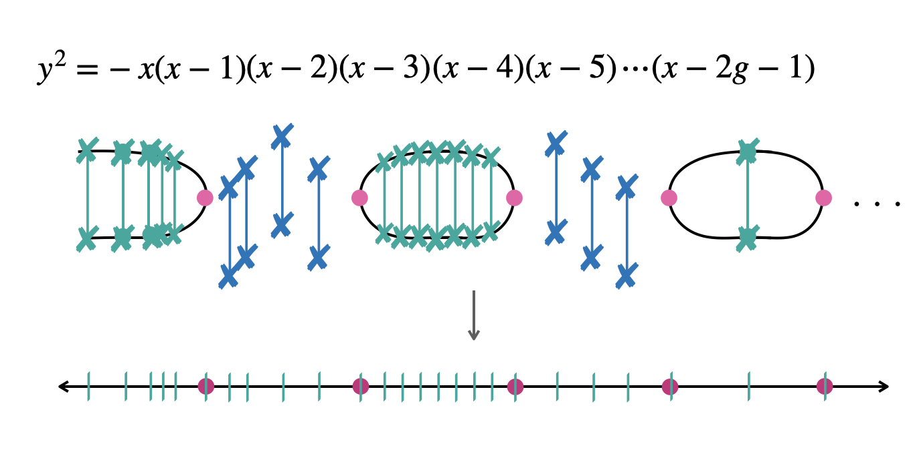
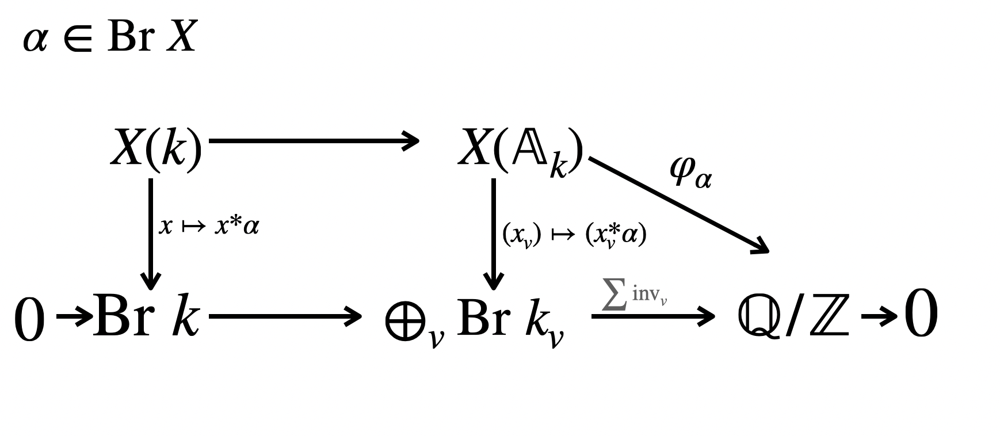
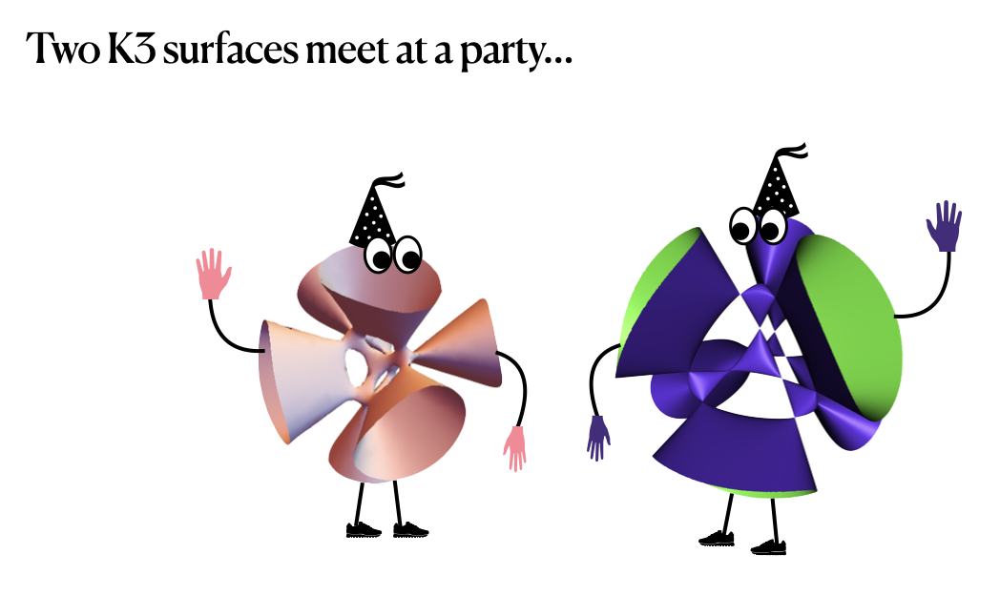

<!-- ## Recent preprints -->

<!-- Add your recent papers here manually, e.g.:
- *Paper title*, joint with Co-author — [arXiv](https://arxiv.org/abs/XXXX.XXXXX)
-->


Complete lists of my preprints and publications can be found on my [arXiv](https://arxiv.org/a/viray_b_1.html) page and on my [MathSciNet author page](https://mathscinet.ams.org/mathscinet/MRAuthorID/890397) (subscription required).


## Research areas
*Under construction: research descriptions in progress*

<!-- ================================================================
  CARD GRID

  HOW TO ADD A NEW CARD:
    1. Create _research-yourarea.qmd with the expanded content (plain markdown)
    2. Copy one card <div> block below; update:
         - id="card-yourarea"
         - onclick="rExpand('yourarea')"
         - img src and alt
         - title and blurb text
    3. Below in the HIDDEN CONTENT section, copy one of the existing
         include blocks and change "curves/brauer/surfaces" to "yourarea".
    4. Below in the JS section, add to rImages and rTitles:
         yourarea: "images/yourimage.png"   (same filename as the img src above)
         yourarea: "Your area title"
================================================================ -->

```{=html}
<div class="r-grid">

  <!-- CARD: Algebraic points on curves
       Image name appears twice: here (img src) and in rImages in the JS section below.
       If you rename the image file, update it in both places. -->
  <div class="r-card" id="card-curves" onclick="rExpand('curves')">
    
    <div class="r-card-body">
      <p class="r-card-title">Algebraic points on curves</p>
      <p class="r-card-blurb">Leveraging geometric tools to organize \(\overline{k}\) points on a curve over a number field.</p>
    </div>
  </div>

  <!-- CARD: The Brauer–Manin obstruction
       Image name appears twice: here (img src) and in rImages in the JS section below.
       If you rename the image file, update it in both places. -->
  <div class="r-card" id="card-brauer" onclick="rExpand('brauer')">
    
    <div class="r-card-body">
      <p class="r-card-title">The Brauer–Manin obstruction</p>
      <p class="r-card-blurb">Capturing subgroups and studying behavior under field extensions.</p>
    </div>
  </div>

  <!-- CARD: Rational points on surfaces
       Image name appears twice: here (img src) and in rImages in the JS section below.
       If you rename the image file, update it in both places. -->
  <div class="r-card" id="card-surfaces" onclick="rExpand('surfaces')">
    
    <div class="r-card-body">
      <p class="r-card-title">Rational points on surfaces</p>
      <p class="r-card-blurb">Explicit computation of the Brauer group and Brauer–Manin obstruction on surfaces.</p>
    </div>
  </div>

</div>

<!-- Expand panel -->
<div class="r-panel" id="r-panel">
  <div class="r-panel-header">
    <h3 id="r-panel-title"></h3>
    <button class="r-close-btn" onclick="rClose()" aria-label="Close">&#x2715;</button>
  </div>
  <div class="r-panel-body">
    <div class="r-panel-content" id="r-panel-content"></div>
  </div>
</div>
```

<!-- ================================================================
  HIDDEN CONTENT SOURCES — one per card
  Each block includes a plain markdown file and hides it.
  The JS below copies the content into the expand panel on click.
================================================================ -->

::: {#src-curves .r-hidden}

:::

::: {#src-brauer .r-hidden}

:::

::: {#src-surfaces .r-hidden}

:::

<!-- ================================================================
  JS — when adding a new card, add one line to rImages and one to rTitles below.
  The image filename here must match the img src in the card above.
================================================================ -->

```{=html}
<script>
var rImages = {
  // Image filename must match the img src in each card above.
  // If you rename an image, update it here AND in the card's img src.
  curves:   "images/P1parameterization.png",
  brauer:   "images/BrauerManinPairing.png",
  surfaces: "images/TwoK3surfaces.png"
};

var rTitles = {
  // Title shown in the expand panel header — usually the same as the card title.
  curves:   "Algebraic points on curves",
  brauer:   "The Brauer–Manin obstruction",
  surfaces: "Rational points on surfaces"
};

var rCurrent = null;

function rExpand(key) {
  if (rCurrent === key) { rClose(); return; }
  rCurrent = key;

  document.querySelectorAll('.r-card').forEach(function(c) { c.classList.remove('active'); });
  document.getElementById('card-' + key).classList.add('active');

  document.getElementById('r-panel-title').textContent = rTitles[key];
  document.getElementById('r-panel-content').innerHTML =
    document.getElementById('src-' + key).innerHTML;

  var panel = document.getElementById('r-panel');
  panel.classList.add('visible');
  panel.scrollIntoView({ behavior: 'smooth', block: 'nearest' });

  if (window.MathJax) { MathJax.typesetPromise([panel]); }
}

function rClose() {
  rCurrent = null;
  document.querySelectorAll('.r-card').forEach(function(c) { c.classList.remove('active'); });
  document.getElementById('r-panel').classList.remove('visible');
}
</script>
```
